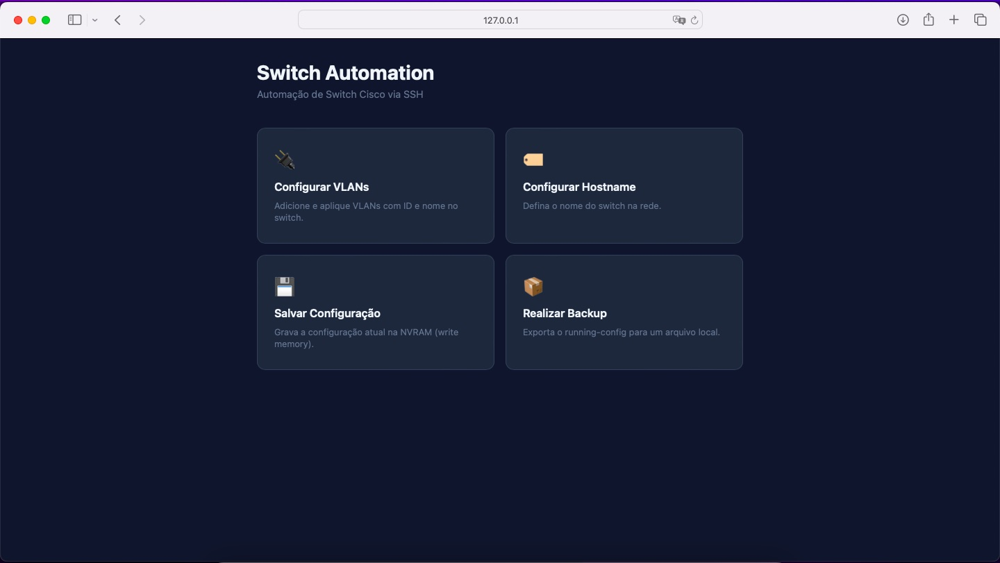
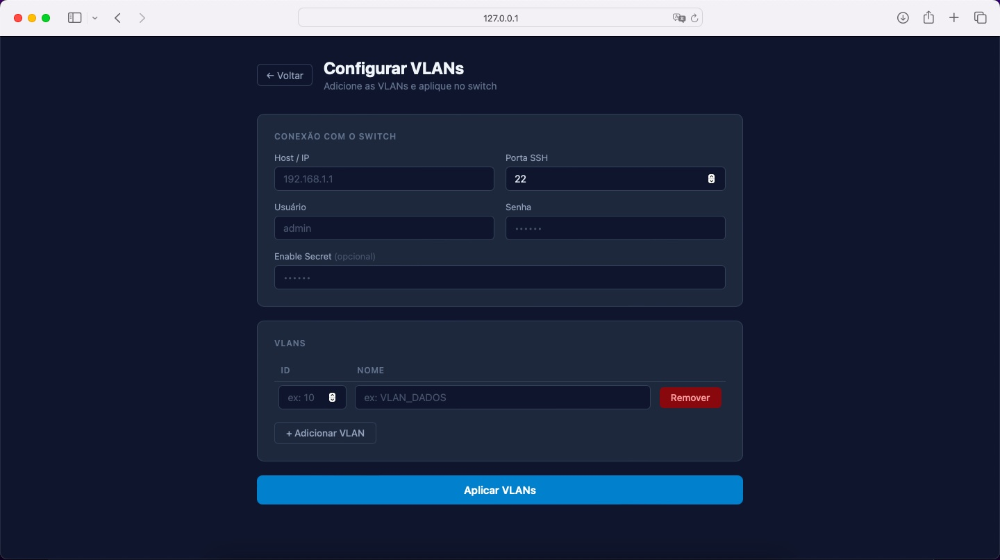
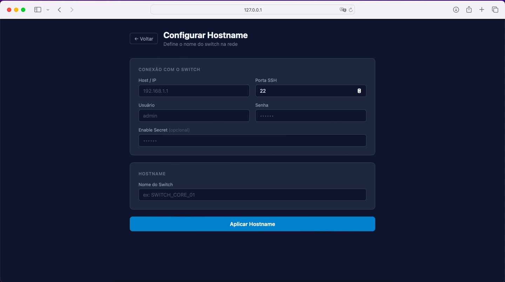
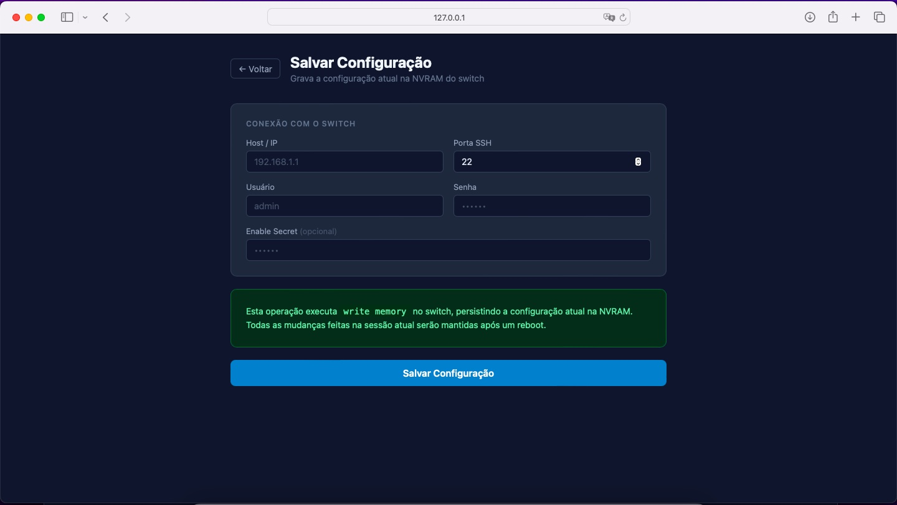

# Cisco Switch Automation — Parte 1

Automação de switch Cisco via SSH com interface web (Flask) para configuração de VLANs, hostname, salvamento e backup de configuração.

## Screenshots







## Visão Geral

Interface web com quatro funções independentes:

| Função | Descrição |
|---|---|
| Configurar VLANs | Adiciona e aplica VLANs (ID + nome) no switch |
| Configurar Hostname | Define o nome do switch |
| Salvar Configuração | Executa `write memory` na NVRAM |
| Realizar Backup | Exporta o `running-config` para arquivo local |

Cada operação inclui validação pós-configuração com alerta em caso de divergência.

## Pré-requisitos

- Python 3.10+
- Switch Cisco simulado via **Packet Tracer** ou **GNS3** com SSH habilitado

## Instalação

```bash
cd parte1

# Criar e ativar o virtualenv
python3 -m venv parte1
source parte1/bin/activate   # Windows: parte1\Scripts\activate

# Instalar dependências
pip install -r requirements.txt
```

## Como Executar

```bash
source parte1/bin/activate
python app.py
```

Acesse `http://localhost:5000` no navegador.

## Configuração SSH no Switch (Packet Tracer / GNS3)

```
Switch(config)# hostname SW-LAB
Switch(config)# ip domain-name lab.local
Switch(config)# crypto key generate rsa modulus 1024
Switch(config)# username admin privilege 15 secret sua_senha
Switch(config)# line vty 0 4
Switch(config-line)# transport input ssh
Switch(config-line)# login local
```

## Backup

Os arquivos de backup são salvos em `backups/` com o formato:

```
<hostname>_<YYYYMMDD_HHMMSS>.txt
```

## Estrutura do Projeto

```
parte1/
├── app.py                  # Flask — rotas e endpoints da API
├── cisco_switch.py         # Classe CiscoSwitch (Netmiko)
├── requirements.txt        # Dependências Python
├── templates/
│   ├── base.html           # Layout e estilos base
│   ├── _connection.html    # Componente de conexão reutilizável
│   ├── index.html          # Menu principal (4 botões)
│   ├── vlan.html           # Configuração de VLANs
│   ├── hostname.html       # Configuração de hostname
│   ├── save.html           # Salvar configuração
│   └── backup.html         # Realizar backup
├── images/                 # Screenshots do frontend
│   ├── frontend.jpg
│   ├── configure_vlan.jpg
│   ├── configure_hostname.jpg
│   ├── save_config.jpg
│   └── execute backup.jpg
└── backups/                # Arquivos de backup gerados automaticamente
```
